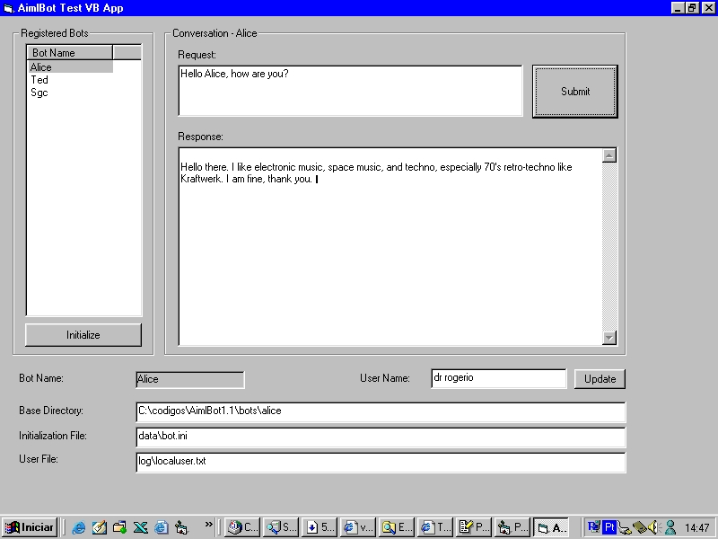



## AIML \- Artificial Inteligence

### Description

Finally a little example of Artificial Intelligence in VB. This code was not developed by me, but i just want to share with you. I perceived that does not exist any example that uses natural language in the PSC, and focus on artificial intelligence in AIML. Therefore they use to advantage to use the ALICE and the TED, the two robots gifts in this example. Gratefulness special to the Dr. Wallace.
 
### More Info
 

             |
---                |---
**Submitted On**   |2002-09-06 11:17:12
**By**             |[Cristiano Couto\.](https://github.com/Planet-Source-Code/PSCIndex/blob/master/ByAuthor/cristiano-couto.md)
**Level**          |Advanced
**User Rating**    |5.0 (10 globes from 2 users)
**Compatibility**  |VB 5\.0, VB 6\.0, VB Script, ASP \(Active Server Pages\) , VBA MS Access, VBA MS Excel
**Category**       |[String Manipulation](https://github.com/Planet-Source-Code/PSCIndex/blob/master/ByCategory/string-manipulation__1-5.md)
**World**          |[Visual Basic](https://github.com/Planet-Source-Code/PSCIndex/blob/master/ByWorld/visual-basic.md)
**Archive File**   |[AIML\_\-\_Art1318799162002\.zip](https://github.com/Planet-Source-Code/cristiano-couto-aiml-artificial-inteligence__1-39051/archive/master.zip)

### API Declarations

Dont forget to register AIMLBOT.DLL present in \bin\debug

